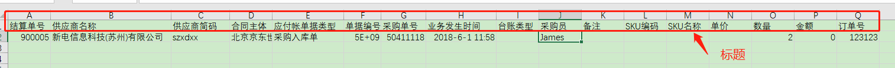

**实现将POJO List序列化成一个Excel(Marshal), 从Excel中读取数据反序列化成POJO列表(Unmarshal)**

* Marshal的过程是通过定义一个Excel模版, 在其中指定每一列对应POJO的属性名来实现. 数字类型可以指定以字符串或者数字的形式写入Excel. 日期类型可以指定日期格式
* Unmarshal的过程是通过在POJO的字段上加@Col注解实现

# 1.序列化成Excel

Doc is TODO...

# 2.Excel反序列化成POJOs

入口类是 `ExcelUnmarshaller`, 你需要创建一个ExcelUnmarshaller对象, 为其指定想要反序列化的Workbook对象或者File对象, 指定要读哪个Sheet, 指定POJO class对象, 是否需要做数据校验.

本工具假设Excel中数据行之前有一行标题, 如下:



POJO类需要在字段上加@Col注解, 与Excel中的列对应起来, 

```java
/**
 * POJO中的字段与Excel中的某列映射
 * <p>
 * Copyright: Copyright (c) 2019-05-23 14:59
 * <p>
 * Company: Sexy Uncle Inc.
 * <p>
 * @author Rico Yu  ricoyu520@gmail.com
 * @version 1.0
 * @on
 */
@Target(ElementType.FIELD)
@Retention(RetentionPolicy.RUNTIME)
public @interface Col {

	/**
	 * 要映射的Excel列名
	 * 
	 * @return
	 */
	String name();

	/**
	 * 实际操作中经常会同样的数据, 出现多个版本的字段名. 比如某列今天叫单据号, 一段时间后改成业务单号
	 * fallback()的作用就是在找不到name()指定的列名时, 转而去找fallback()指定的列
	 * 
	 * @return String
	 * @on
	 */
	String fallback() default "";

	/**
	 * 有时可能不想用列名去匹配, 比如我确定这个字段要映射到第一列. 
	 * 如果指定了index, 那么name和fallback就忽略了
	 * 
	 * @return
	 */
	int index() default -1;
}
```

## 2.1 示例

### 1) POJO

```java
@Data
public class SettlementItem {

	@Col(name = "结算单号")
	private String settlementId; // JD 京东结算单号

	@Col(name = "供应商名称")
	private String supplier; // 供应商名称

	@Col(name = "供应商简码")
	private String supplierCode; // 供应商简码

	@Col(name = "合同主体")
	private String contractSubject;// 合同主体

	@Col(name = "应付帐单据类型")
	private Ticket ticket; // 应付帐单据类型

	@Col(name = "单据编号")
	private String ticketId; // 单据编号

	@Col(name = "业务单号", fallback = "采购单号")
	private String businessId; // 采购单号

	@Col(name = "业务发生时间")
	private LocalDateTime businessTime; // 业务发生时间

	@Col(name = "台账类型")
	@NotNull(message = "台账类型不能为空")
	private String deskType; // 台账类型

	@Col(name = "采购员")
	private String purchaser; // 采购员

	@Col(name = "备注")
	private String remark; // 备注

	@Col(name = "SKU编码")
	private Integer skuCode; // SKU编码

	@Col(name = "SKU名称")
	private String skuName; // SKU名称

	@Col(name = "单价")
	private BigDecimal unitPrice; // 单价

    @Col(name = "数量")
	@Min(value = 2, message = "数量最少2个起购")
	private Long qty; // 数量

	@Col(name = "金额")
	private BigDecimal amount; // 金额

	@Col(name = "订单号")
	private String orderId; // 订单号

}
```

注意`@NotNull(message = "台账类型不能为空")`, `@Min(value = 2, message = "数量最少2个起购")`是JSR380标准API, 后面会讲到

### 2) 客户端代码

```java
@Test
public void testUnmarshall() throws Exception {
    File file = IOUtils.readClasspathFileAsFile("excel/958395-one.csv");
	//Workbook workbook = ExcelUtils.getWorkbook(IOUtils.readClasspathFileAsFile("excel/958395-one.csv"));
    long begin = System.currentTimeMillis();
    List<SettlementItem> settlementItems = ExcelUnmarshaller.builder()
            //.workbook(workbook)
            .file(file)
            .sheetName("992704（2018.9.4结算 ）")
            .fallbackSheetIndex(0) //表示指定的sheetName不存在时按照Sheet的Index获取Sheet
            .pojoType(SettlementItem.class) //要反序列化成哪个POJO类
            .validate(true) //是否要对POJO做数据校验
            .build()
            .unmarshall(); //真正开始干活
    
    long end = System.currentTimeMillis();
    System.out.println("Total row : " + settlementItems.size() + ", Cost " + (end - begin) + " miliseconds");
    System.out.println(toJson(settlementItems));
}
```

## 2.2 数据校验

添加Maven依赖

```xml
<!-- JSR 380 Validation API -->
<dependency>
    <groupId>javax.validation</groupId>
    <artifactId>validation-api</artifactId>
    <version>2.0.0.Final</version>
</dependency>
<dependency>
    <groupId>org.hibernate.validator</groupId>
    <artifactId>hibernate-validator</artifactId>
    <version>6.0.2.Final</version>
</dependency>
<dependency>
    <groupId>org.hibernate.validator</groupId>
    <artifactId>hibernate-validator-annotation-processor</artifactId>
    <version>6.0.2.Final</version>
</dependency>
<dependency>
    <groupId>javax.el</groupId>
    <artifactId>javax.el-api</artifactId>
    <version>3.0.0</version>
</dependency>
<dependency>
    <groupId>org.glassfish.web</groupId>
    <artifactId>javax.el</artifactId>
    <version>2.2.6</version>
</dependency>
```

采用JSR380 Bean Validation标准, Hibernate Validator实现, 当校验失败时抛出`BindException.BindException`

Stacktrace示例:

```java
BindException: [ConstraintViolationImpl{interpolatedMessage='台账类型不能为空', propertyPath=deskType, rootBeanClass=class SettlementItem, messageTemplate='台账类型不能为空'}]
	at ExcelUnmarshaller.unmarshall(ExcelUnmarshaller.java:124)
	at ExcelUnmarshellTest.testUnmarshall(ExcelUnmarshellTest.java:32)
```

